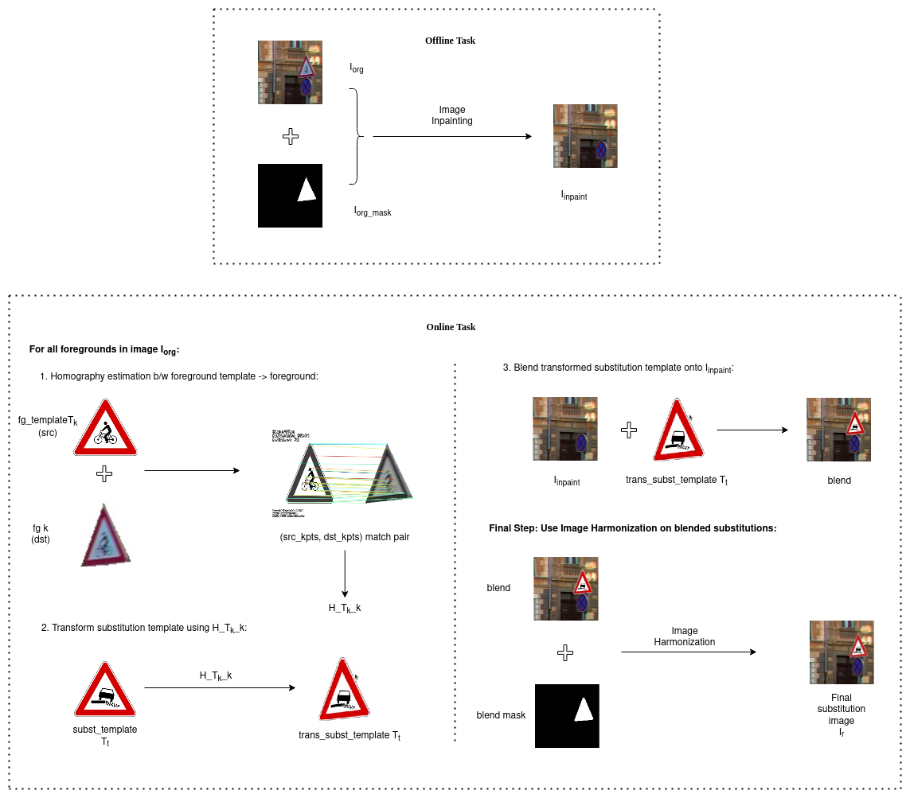
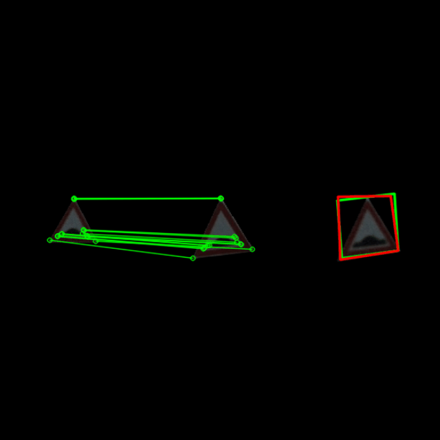
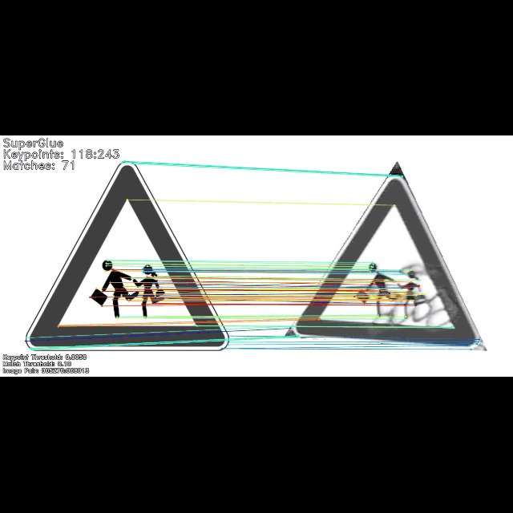

## Traffic sign substitution via Homography

### Dataset

DFG Traffic Sign Data Set

- 200 traffic sign categories captured in Slovenian roads
- 5254 training images and 1703 testing images
- 13239 tightly annotated (polygon) traffic sign instances larger than 30 px
- 4359 loosely annotated (bounding box) traffic sign instances smaller than 30 px marked as ignore
- roughly 70% of categories with a low appearance changes and 30% with a large appearance variability
- Website: https://www.vicos.si/resources/dfg/

<p align="center">
  
</p>

### Pipeline

<p align="center">
  
</p>

### Preparation
Tested on Ubuntu 22.04, GTX 1070, CUDA 11.7, Python 3.10
1. Clone this repository, run ```conda env create -f environment.yml```
2. Download DFG Traffic Sign Data Set and annotations from [here](https://www.vicos.si/resources/dfg/)
3. Download SuperPoint and SuperGlue weights from [here](https://github.com/magicleap/SuperGluePretrainedNetwork/tree/master/models/weights) and place in ```models/weights```
4. Download official RainNet weight from [here](https://drive.google.com/file/d/1nVJFQ1iAGMeZ-ZybJm9vBQfvYs6tkctZ/view?usp=sharing) and place in ```checkpoints/experiment/```

### Substitution

- Place DFG dataset images in ```examples/DFG```
- Place foreground inpainted images in ```examples/inpainted``` (Look into ```src/create_lama_data.py``` and https://github.com/sayanxtreme/trafficsign_substitution/blob/lama/lama.ipynb)
- The sign templates are placed in ```examples/templates2``` which will be used for both homography and substitution
- Run ```python main.py``` for substitution
- Run ```python main_maskrcnn.py``` for substitution that also saves the new bbox and mask annotations

### Benchmark Homography

1. First extract roadsign crops using ```src/save2folder.py```
2. Change paths and run ```python benchmark_homography.py```

- Creates homography dataset with random geometric and photometric augmentations and saves the image pair and H_1_2 matrix
- Uses Mean Average Corner Error from Deep Image Homography Estimation [paper](https://arxiv.org/pdf/1606.03798.pdf) for benchmarking on normalized homography gt-pred pair. Normalized image corners: ```[[-1, -1], [1, -1], [1, 1], [-1, 1]]```
- In below examples, first img1, second img2, green lines are ORB matches, third is predicted transformation with green bbox H_1_2_gt four corners, and red bbox H_1_2_pred four corners.
<p align="center">
  
</p>

#### Black background
#### 1920
1. ORB+BFMatcher MACE: 24.70120317414624, Miss: 386, Average matches: 154.17790069138906
2. AKAZE+BFMatcher MACE: 35.20640864155389, Miss: 2674, Average matches: 45.97548483474271
3. BRISK+BFMatcher MACE: 35.86339756906804, Miss: 1174, Average matches: 53.67866211814194
4. SuperPoint+SuperGlue MACE: 16.19845761880025, Miss: 106, Average matches: 51.03567594557484
5. ORB-BFMatcher+SuperPoint-SuperGlue MACE: 10.820172100490437, Miss: 47, Average matches: 50.96477539013811

#### 800
1. ORB+BFMatcher MACE: 63.17131938102614, Miss: 766, Average matches: 66.90303337987054
2. AKAZE+BFMatcher MACE: 114.18250320457729, Miss: 9453, Average matches: 17.51667317962746
3. BRISK+BFMatcher MACE: 89.22819533970527, Miss: 2773, Average matches: 28.04025355729111
4. SuperPoint+SuperGlue MACE: 99.18764054861977, Miss: 887, Average matches: 20.345648520649792
5. ORB-BFMatcher+SuperPoint-SuperGlue MACE: 51.77292614950893, Miss: 118, Average matches: 20.004195489848414

#### White background
#### 1920
1. ORB+BFMatcher MACE: 12.332896810792427, Miss: 32, Average matches: 162.9177153679384
2. AKAZE+BFMatcher MACE: 23.889963308656203, Miss: 133, Average matches: 55.191790746477466
3. BRISK+BFMatcher MACE: 44.15308806779322, Miss: 174, Average matches: 56.16417835796634
4. SuperPoint+SuperGlue MACE: 16.050153812201053, Miss: 63, Average matches: 51.964337373435086
5. ORB-BFMatcher+SuperPoint-SuperGlue MACE: 5.1721129948081135, Miss: 0, Average matches: 51.887527701003464

#### 800
1. ORB+BFMatcher MACE: 79.18184477307678, Miss: 97, Average matches: 68.50586561501598
2. AKAZE+BFMatcher MACE: 87.32104194811052, Miss: 4080, Average matches: 21.933205842410132
3. BRISK+BFMatcher MACE: 225.5694512458189, Miss: 895, Average matches: 27.763306677532725
4. SuperPoint+SuperGlue MACE: 59.52518970416643, Miss: 1008, Average matches: 21.02901437948561
5. ORB-BFMatcher+SuperPoint-SuperGlue MACE: 81.6209639032882, Miss: 2, Average matches: 20.571976393834507

### Results
#### 1. Foreground Removal (Lama Inpainting)
- GT vs inpainted (```results/lama```)
- More samples can be found [here](https://drive.google.com/drive/folders/1QapycCJxz8XGpuhcYL1YLrnXeSOyBekP?usp=sharing)
- LAMA vs OpenCV FFM LPIPS scores using this [code](https://github.com/richzhang/PerceptualSimilarity)\
    LPIPS LAMA: 0.00745\
    LPIPS OpenCV: 0.00770

<p align="center">
  
</p>

#### 2. Keypoint Detection+Matching (SuperPoint+SuperGlue)
- Template to GT matching  (```results/superglue```)
- More samples can be found [here](https://drive.google.com/drive/folders/1xjikDIGCxss-jcjo0quPyeCzSEVcIVH3?usp=sharing)

<p align="center">
  
</p>

#### 3. Harmonization (RainNet)
- Copy-Paste substitution vs Harmonized  (```results/rainnet```)
- More samples can be found [here](https://drive.google.com/drive/folders/12bHSnuQIqnTO6ARbNNiWS-r9yb9x5U--?usp=sharing)

<p align="center">
  
</p>

#### 4. Final Substitution result
- Original GT roadsigns vs substituted roadsigns (Inpaint+Homography+Harmonization)  (```results/substitution```)
- More samples can be found [here](https://drive.google.com/drive/folders/1iOzQegPhS9PK_cpONQqq6uxdqkMP0iiy?usp=sharing)

<p align="center">
  
</p>

### 5. MaskRCNN ResNet50 no_arbitrary classes, n_class=117, epoch=35 [weights_link](https://drive.google.com/file/d/1H6nU-L_yoD0XZdLl7KqnzH_VQfZNebB2/view?usp=sharing)

- To remove arbitrary classes from groundtruth annotations, use ```src/create_custom.py```
- To run substitution pipeline that saves substitution annotations, run ```python main_maskrcnn.py```
- To train, test and run inference on MaskRCNN, check ```maskrcnn/README.md```
- Test
```
IoU metric: bbox
 Average Precision  (AP) @[ IoU=0.50:0.95 | area=   all | maxDets=100 ] = 0.732
 Average Precision  (AP) @[ IoU=0.50      | area=   all | maxDets=100 ] = 0.836
 Average Precision  (AP) @[ IoU=0.75      | area=   all | maxDets=100 ] = 0.819
 Average Precision  (AP) @[ IoU=0.50:0.95 | area= small | maxDets=100 ] = 0.303
 Average Precision  (AP) @[ IoU=0.50:0.95 | area=medium | maxDets=100 ] = 0.824
 Average Precision  (AP) @[ IoU=0.50:0.95 | area= large | maxDets=100 ] = 0.894
 Average Recall     (AR) @[ IoU=0.50:0.95 | area=   all | maxDets=  1 ] = 0.776
 Average Recall     (AR) @[ IoU=0.50:0.95 | area=   all | maxDets= 10 ] = 0.789
 Average Recall     (AR) @[ IoU=0.50:0.95 | area=   all | maxDets=100 ] = 0.789
 Average Recall     (AR) @[ IoU=0.50:0.95 | area= small | maxDets=100 ] = 0.415
 Average Recall     (AR) @[ IoU=0.50:0.95 | area=medium | maxDets=100 ] = 0.873
 Average Recall     (AR) @[ IoU=0.50:0.95 | area= large | maxDets=100 ] = 0.909
IoU metric: segm
 Average Precision  (AP) @[ IoU=0.50:0.95 | area=   all | maxDets=100 ] = 0.743
 Average Precision  (AP) @[ IoU=0.50      | area=   all | maxDets=100 ] = 0.834
 Average Precision  (AP) @[ IoU=0.75      | area=   all | maxDets=100 ] = 0.810
 Average Precision  (AP) @[ IoU=0.50:0.95 | area= small | maxDets=100 ] = 0.288
 Average Precision  (AP) @[ IoU=0.50:0.95 | area=medium | maxDets=100 ] = 0.842
 Average Precision  (AP) @[ IoU=0.50:0.95 | area= large | maxDets=100 ] = 0.943
 Average Recall     (AR) @[ IoU=0.50:0.95 | area=   all | maxDets=  1 ] = 0.788
 Average Recall     (AR) @[ IoU=0.50:0.95 | area=   all | maxDets= 10 ] = 0.800
 Average Recall     (AR) @[ IoU=0.50:0.95 | area=   all | maxDets=100 ] = 0.800
 Average Recall     (AR) @[ IoU=0.50:0.95 | area= small | maxDets=100 ] = 0.408
 Average Recall     (AR) @[ IoU=0.50:0.95 | area=medium | maxDets=100 ] = 0.890
 Average Recall     (AR) @[ IoU=0.50:0.95 | area= large | maxDets=100 ] = 0.947
 ```
- Test substitution
```
IoU metric: bbox
 Average Precision  (AP) @[ IoU=0.50:0.95 | area=   all | maxDets=100 ] = 0.556
 Average Precision  (AP) @[ IoU=0.50      | area=   all | maxDets=100 ] = 0.709
 Average Precision  (AP) @[ IoU=0.75      | area=   all | maxDets=100 ] = 0.684
 Average Precision  (AP) @[ IoU=0.50:0.95 | area= small | maxDets=100 ] = 0.160
 Average Precision  (AP) @[ IoU=0.50:0.95 | area=medium | maxDets=100 ] = 0.692
 Average Precision  (AP) @[ IoU=0.50:0.95 | area= large | maxDets=100 ] = 0.745
 Average Recall     (AR) @[ IoU=0.50:0.95 | area=   all | maxDets=  1 ] = 0.626
 Average Recall     (AR) @[ IoU=0.50:0.95 | area=   all | maxDets= 10 ] = 0.629
 Average Recall     (AR) @[ IoU=0.50:0.95 | area=   all | maxDets=100 ] = 0.629
 Average Recall     (AR) @[ IoU=0.50:0.95 | area= small | maxDets=100 ] = 0.260
 Average Recall     (AR) @[ IoU=0.50:0.95 | area=medium | maxDets=100 ] = 0.750
 Average Recall     (AR) @[ IoU=0.50:0.95 | area= large | maxDets=100 ] = 0.761
IoU metric: segm
 Average Precision  (AP) @[ IoU=0.50:0.95 | area=   all | maxDets=100 ] = 0.636
 Average Precision  (AP) @[ IoU=0.50      | area=   all | maxDets=100 ] = 0.709
 Average Precision  (AP) @[ IoU=0.75      | area=   all | maxDets=100 ] = 0.701
 Average Precision  (AP) @[ IoU=0.50:0.95 | area= small | maxDets=100 ] = 0.189
 Average Precision  (AP) @[ IoU=0.50:0.95 | area=medium | maxDets=100 ] = 0.785
 Average Precision  (AP) @[ IoU=0.50:0.95 | area= large | maxDets=100 ] = 0.863
 Average Recall     (AR) @[ IoU=0.50:0.95 | area=   all | maxDets=  1 ] = 0.711
 Average Recall     (AR) @[ IoU=0.50:0.95 | area=   all | maxDets= 10 ] = 0.714
 Average Recall     (AR) @[ IoU=0.50:0.95 | area=   all | maxDets=100 ] = 0.714
 Average Recall     (AR) @[ IoU=0.50:0.95 | area= small | maxDets=100 ] = 0.313
 Average Recall     (AR) @[ IoU=0.50:0.95 | area=medium | maxDets=100 ] = 0.843
 Average Recall     (AR) @[ IoU=0.50:0.95 | area= large | maxDets=100 ] = 0.868
```

### Documentation

- Report available at ```Traffic_Sign_Substitution_Report.pdf``` and [here](https://drive.google.com/file/d/1DW5-DInTQ4mtcpPo_3zQoucy47XTcYZE/view?usp=sharing)
- Slides available at ```TrafficSign_substitution_slides.pdf``` and [here](https://drive.google.com/file/d/1dAuNSzZ99FyNALrdv4IU9HuRw7ce-Hk8/view?usp=sharing)

### Citation
```
 @article{Tabernik2019ITS,
    author = {Tabernik, Domen and Sko{\v{c}}aj, Danijel},
    journal = {IEEE Transactions on Intelligent Transportation Systems},
    title = {{Deep Learning for Large-Scale Traffic-Sign Detection and Recognition}},
    year = {2019},
    doi={10.1109/TITS.2019.2913588}, 
    ISSN={1524-9050}
 }

@article{suvorov2021resolution,
  title={Resolution-robust Large Mask Inpainting with Fourier Convolutions},
  author={Suvorov, Roman and Logacheva, Elizaveta and Mashikhin, Anton and Remizova, Anastasia and Ashukha, Arsenii and Silvestrov, Aleksei and Kong, Naejin and Goka, Harshith and Park, Kiwoong and Lempitsky, Victor},
  journal={arXiv preprint arXiv:2109.07161},
  year={2021}
}

@inproceedings{detone18superpoint,
  author    = {Daniel DeTone and
               Tomasz Malisiewicz and
               Andrew Rabinovich},
  title     = {SuperPoint: Self-Supervised Interest Point Detection and Description},
  booktitle = {CVPR Deep Learning for Visual SLAM Workshop},
  year      = {2018},
  url       = {http://arxiv.org/abs/1712.07629}
}

@inproceedings{sarlin20superglue,
  author    = {Paul-Edouard Sarlin and
               Daniel DeTone and
               Tomasz Malisiewicz and
               Andrew Rabinovich},
  title     = {{SuperGlue}: Learning Feature Matching with Graph Neural Networks},
  booktitle = {CVPR},
  year      = {2020},
  url       = {https://arxiv.org/abs/1911.11763}
}

@inproceedings{ling2021region,
  title={Region-aware Adaptive Instance Normalization for Image Harmonization},
  author={Ling, Jun and Xue, Han and Song, Li and Xie, Rong and Gu, Xiao},
  booktitle={Proceedings of the IEEE/CVF Conference on Computer Vision and Pattern Recognition},
  pages={9361--9370},
  year={2021}
}
```
### Acknowledgement

* Inpainting code+weights borrowed from [lama](https://github.com/advimman/lama)
* Keypoint detection+matching code+weights borrowed from [SuperGluePretrainedNetwork](https://github.com/magicleap/SuperGluePretrainedNetwork)
* Harmonization code+weights borrowed from [RainNet](https://github.com/junleen/RainNet)
* For homography data and evaluation, code borrowed from [Theseus](https://github.com/facebookresearch/theseus/blob/main/examples/homography_estimation.py)